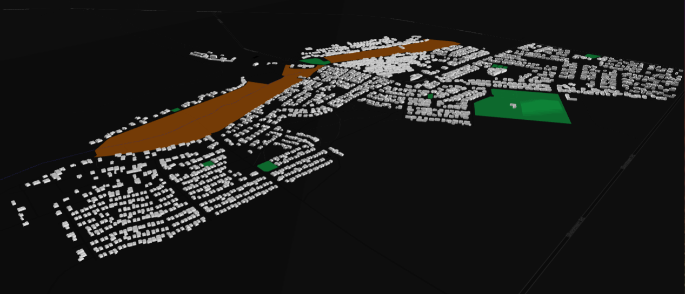
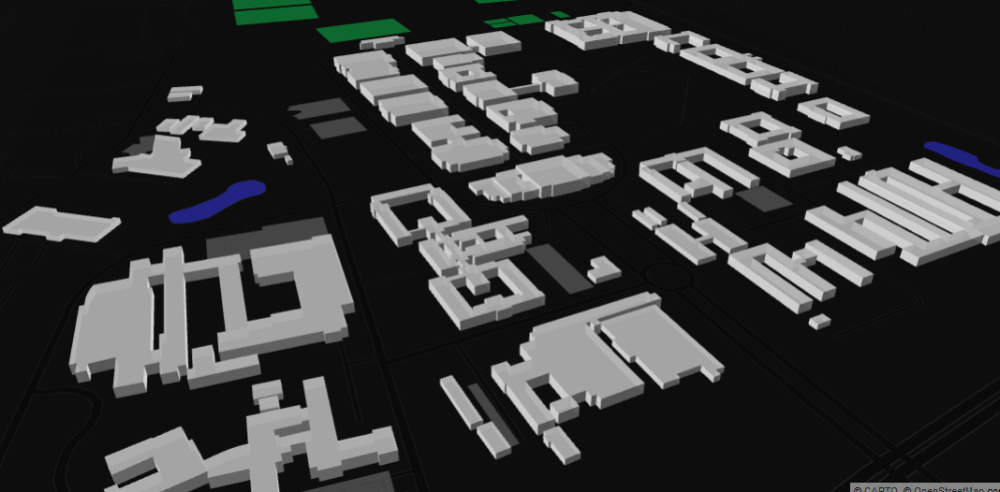

# Level-of-Detail 1 (loD1) 3D Building Models from OpenStreetMap

We follow the awesome [Filip Biljecki](https://filipbiljecki.com/) and [NUS Urban Analytics Lab](https://ual.sg/) at the [National University of Singapore](https://www.nus.edu.sg/) and generate LoD1 3D buildings models from volunteered Public Data; namely OpenStreetMap. 

The original repositories are [here](https://github.com/ualsg).

The [osm_lod1_3dbuildingmodel.ipynb](https://github.com/AdrianKriger/osm_LoD1_3Dbuildings/blob/main/osm_lod1_3dbuildingmodel.ipynb) notebook should produce CityJSON files and an interactive .html which you can navigate with queriable features ~ A static .png below for reference + another of a different area.

 

