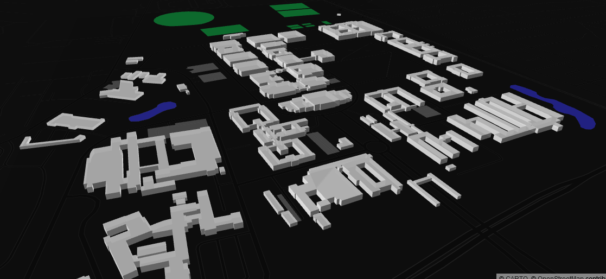

# Level-of-Detail 1 (LoD1) 3D Building Models from OpenStreetMap

<h1 align="center"> Be Aware:The functionality of this repository has been improved on and is now part of a larger deliverable (LoD1 3D City Model *- buildings and terain*). Available at [osm_LoD1_3DCityModel](https://github.com/AdrianKriger/osm_LoD1_3DCityModel).  
</h1> 

We follow the awesome [Filip Biljecki](https://filipbiljecki.com/) and [NUS Urban Analytics Lab](https://ual.sg/) at the [National University of Singapore](https://www.nus.edu.sg/) and generate LoD1 3D buildings models from volunteered Public Data; namely [OpenStreetMap](https://en.wikipedia.org/wiki/OpenStreetMap). 

The original repositories (*hdb3d-data and hdb3d-code* ~ under MIT License) are [here](https://github.com/ualsg).  
And the paper  
`Biljecki, F.: EXPLORATION OF OPEN DATA IN SOUTHEAST ASIA TO GENERATE 3D BUILDING MODELS, ISPRS Ann. Photogramm. Remote Sens. Spatial Inf. Sci., VI-4/W1-2020, 37–44, https://doi.org/10.5194/isprs-annals-VI-4-W1-2020-37-2020, 2020`  
is [here](https://www.isprs-ann-photogramm-remote-sens-spatial-inf-sci.net/VI-4-W1-2020/37/2020/).

The [osm_lod1_3dbuildingmodel.ipynb](https://github.com/AdrianKriger/osm_LoD1_3Dbuildings/blob/main/osm_lod1_3dbuildingmodel.ipynb) notebook should produce CityJSON files and an interactive .html which you can navigate with queriable features ~ A static .png below for reference + another of a different area.

 

**NOTE:**  
*This workflow is not meant to scale.*  
Requests for an extreme amount of data from the [osm](https://en.wikipedia.org/wiki/OpenStreetMap) server is destructive to the entire community. Village, Suburb and Campus analysis only please. For a larger area (city, state) consider harvesting data via `.pbf` ([geofabric](https://download.geofabrik.de/index.html) or [planet](https://planet.osm.org/)) - raise an issue and we can work on an alternate processing strategy.
